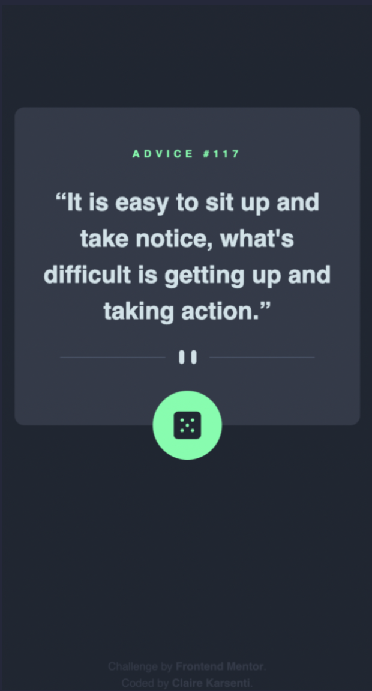
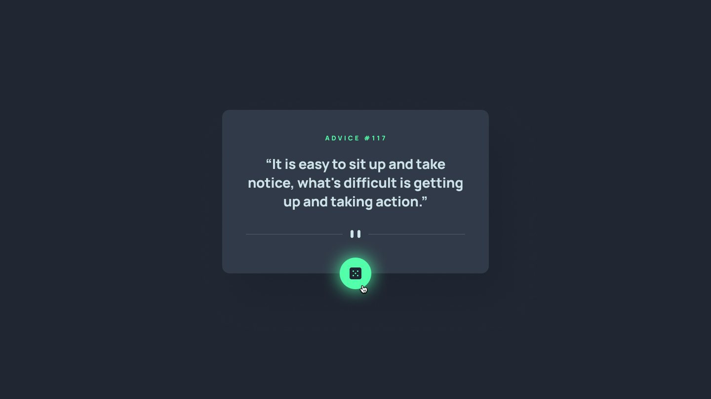

# Frontend Mentor - Advice generator app solution

This is a solution to the [Advice generator app challenge on Frontend Mentor](https://www.frontendmentor.io/challenges/advice-generator-app-QdUG-13db).
Frontend Mentor challenges help me improve my coding skills by building realistic projects.

## Table of contents

- [Frontend Mentor - Advice generator app solution](#frontend-mentor---advice-generator-app-solution)
  - [Table of contents](#table-of-contents)
  - [Overview](#overview)
    - [The challenge](#the-challenge)
    - [Models & my works](#models--my-works)
      - [Desktop version](#desktop-version)
      - [Mobile version](#mobile-version)
      - [Active states version](#active-states-version)
      - [Demo video](#demo-video)
    - [Links](#links)
  - [My process](#my-process)
    - [Built with](#built-with)
    - [What I deepened](#what-i-deepened)
  - [Setup](#setup)
  - [Author](#author)

## Overview

### The challenge

Users should be able to:

- View the optimal layout for the app depending on their device's screen size
- See hover states for all interactive elements on the page
- Generate a new piece of advice by clicking the dice icon

### Models & my works

#### Desktop version

Model:


My work:


#### Mobile version

Model:


My work:



#### Active states version

Model:



My work:


#### Demo video

https://user-images.githubusercontent.com/102292921/199338784-1e0543c1-3edf-47cd-9158-8d3fbb80fa04.mov

### Links

- Solution URL: [Code on GitHub](https://github.com/ClaireKarsenti/Frontend-Mentor-Solution-Advice-Generator-App)
- Live Site URL: [GitHub Pages Live URL](https://clairekarsenti.github.io/Frontend-Mentor-Solution-Advice-Generator-App/)

## My process

### Built with

- Semantic HTML5 markup
- CSS Animations
- Styled Components
- API
- React
- TypeScript
- Mobile-first workflow

### What I deepened

I choose to do this project in TypeScript language and with the framework React to deepen my skills in these fields.
This challenge also allowed me to deepen my knowledge of CSS and Animations for the layout part of this project.

Here are some example of the custom features I added to this project:

- :game_die: An animation on the dice, when the user click on the dice's button, during the loading of the advice the dice keep rotating until the API return the advice.

  ```js
  <button onClick={getAdvice} aria-label="dice">
    
  </button>
  ```

  ```css
  button img {
    width: 100%;
    height: 100%;
  }
  button img.loading {
    animation: rotation 1s infinite linear;
    @keyframes rotation {
      from {
        transform: rotate(0deg);
      }
      to {
        transform: rotate(359deg);
      }
    }
    transition: 0.3s ease-in-out;
  }
  ```

- :rotating_light: A custom alert message is displayed if there is an error with API fetching. I chose to display this alert message with a neon effect to match the design of this project, and also added a flashing effect to it.

  ```js
  {
    error ? (
      alert.show && <Alert {...alert} showAlert={showAlert} />
    ) : (
      <>
        <span>Advice #{adviceNumber}</span>
        <q>{advice}</q>
      </>
    );
  }
  ```

  ```css
  .alert {
    margin: auto;
    font-size: 1.3em;
    padding: 2em;
    color: var(--neon-green);
    text-shadow: 0 0 7px var(--neon-green), 0 0 10px var(--neon-green),
      0 0 21px var(--neon-green), 0 0 25px var(--neon-green),
      0 0 31px var(--neon-green);
    animation: flashing 5s infinite;
    transition: none;
  }
  @keyframes flashing {
    0% {
      opacity: 1;
    }
    40% {
      opacity: 0;
    }
    100% {
      opacity: 1;
    }
  }
  ```

## Setup

To run this project, install it locally using yarn:

```
yarn add && yarn start
```

## Author

- Linkedin - [Claire Karsenti](https://www.linkedin.com/in/claire-karsenti/)
- Frontend Mentor - [@ClaireKarsent](https://www.frontendmentor.io/profile/ClaireKarsenti)
